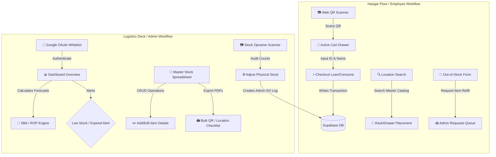

# 📦 GMF Inventory Control System (Stock Opname)

[](https://nextjs.org/)
[](https://www.typescriptlang.org/)
[](https://tailwindcss.com/)
[](https://supabase.com/)
[](https://supabase.com/)
[-blueviolet?style=flat-square&logo=mathworks)](https://en.wikipedia.org/wiki/Croston_method)

A production-grade, full-stack inventory management, stock opname, and predictive replenishment system designed for aviation MRO (Maintenance, Repair, and Overhaul) facilities—specifically modeled for the operation workflows of **GMF AeroAsia**. 

This system tackles the critical challenges of tracking aircraft spare parts, monitoring chemical shelf-lives, and optimizing stock replenishment levels. It features an integrated web-camera QR scanner, automated QR label PDF exports, and a math-driven forecasting engine for slow-moving, intermittent inventory demand.

---

## 🌟 Portfolio Highlights & Technical Architecture

This project is built to demonstrate enterprise-level full-stack engineering, math-based business forecasting, and seamless hardware-software integration:

1. **Intermittent Demand Forecasting (SBA Model)**: Implements the **Syntetos-Boylan Approximation (SBA)**. Standard forecasting models (like Exponential Smoothing) break down and introduce extreme positive bias when dealing with slow-moving inventory (items that have long periods of zero demand). The system uses SBA to compute unbiased future demand, safety stock thresholds, and automated Reorder Points (ROP) to prevent stockouts of critical materials.
2. **Bi-directional QR Scanning Workflow**: Leveraging the device camera via `html5-qrcode`, the application handles scanning workflows on both ends:
   * **General Employees**: Scan item QR codes to instantly add tools or consumables to a borrowing cart, check out with active tracking, and register returns.
   * **Warehouse Administrators**: Scan item QR codes to perform physical audits (**Stock Opname**), prompting immediate database updates and audit history trail generation.
3. **Enterprise-Grade Security & Authorization**: The Admin Dashboard is protected by a dual-stage check: a secure Google OAuth login backed by an environment-defined email whitelist (`NEXT_PUBLIC_ADMIN_EMAILS`). Non-whitelisted users are automatically logged out and blocked.
4. **Dynamic PDF Generation & Bulk Printing**: A custom printing utility dynamically renders single or bulk QR sheets, as well as location-based physical stock checklists displaying chemical expiration countdown alerts, ready for thermal label or standard laser printers.

---

## 🛠️ Tech Stack & Key Libraries

* **Frontend Framework**: [Next.js 16 (App Router)](https://nextjs.org/) using Server-Side Rendering (SSR) paradigms with Client-Side Hydration.
* **Programming Language**: [TypeScript](https://www.typescriptlang.org/) for compile-time type-safety.
* **Styling & UI**: [Tailwind CSS v4](https://tailwindcss.com/) using an advanced, sleek design language with smooth micro-animations.
* **Database & Realtime**: [Supabase](https://supabase.com/) (PostgreSQL engine) leveraging real-time table listeners to push live feeds to employee feeds.
* **QR Engine**: [html5-qrcode](https://github.com/mebjas/html5-qrcode) for robust camera stream parsing and file-upload scanning.
* **QR Generator**: External API engine (qrserver.com) for on-the-fly UUID barcode translations.

---

## 📋 System Workflows & User Modules

The system divides operations into two distinct workflows tailored for the hangar floor and the logistics deck:



### 1. General Employee Portal (`/`)
* **Hangar Checkouts**: Employees scan physical QR codes attached to parts bins or chemicals. Scanned items are placed into a sliding cart drawer.
* **Loan and Consumption Tracking**: Items are designated as **Bulk** (consumed and not returned, like safety wires or solvents) or **Units** (borrowed and returned, like calibration tools).
* **Return Drawer**: Provides a clean interface for employees to clear their active borrow records.
* **Location Finder**: Modal search indexing that enables technicians to locate parts inside physical rack/drawer placements instantly.

### 2. Admin Dashboard (`/so`)
* **Real-time Overview Analytics**: Visualizes total parts count, pending user requests, low-stock warnings, and historical borrowing charts.
* **Smart Stock Opname**: Streamlined audit tab where admins scan bins, input physical counts, and the system instantly logs discrepancies.
* **Master Inventory CRUD**: Administrators can control parameters for each inventory node, including batch numbers, Units of Measure (PCS, ROLL, CAN), chemical expiration dates, lead times, and custom smoothing factors ($\alpha$).
* **Request Management**: Review employee demands for out-of-stock items, mark requests as resolved, or reject them.

---

## 🧮 Mathematical Forecasting Model (SBA)

Traditional replenishment models (such as Simple Exponential Smoothing or Croston's Method) suffer from mathematical bias when calculating demand for intermittent items (slow-moving inventory common in aviation MROs). The **Syntetos-Boylan Approximation (SBA)** resolves this by introducing a bias correction factor.

### 1. Exponentially Smoothed Demand Size ($z_t$)
When a positive demand occurs at period $t$:
$$z_t = \alpha \cdot Y_t + (1 - \alpha) \cdot z_{t-1}$$
*(Where $Y_t$ is the actual demand quantity and $\alpha$ is the smoothing factor, default `0.30`)*

### 2. Exponentially Smoothed Demand Interval ($p_t$)
Tracks the interval of time (in weeks) between demands:
$$p_t = \alpha \cdot q + (1 - \alpha) \cdot p_{t-1}$$
*(Where $q$ is the number of periods since the last positive demand)*

### 3. Unbiased SBA Forecast Estimation ($\hat{Y}_{SBA}$)
SBA scales the Croston estimate by a bias-correcting coefficient:
$$\hat{Y}_{SBA} = \left(1 - \frac{\alpha}{2}\right) \cdot \frac{z_t}{p_t}$$

### 4. Safety Stock Calculation
Calculates the required buffer size to absorb demand variations:
$$\text{Safety Stock} = \lceil \hat{Y}_{SBA} \times 1.5 \rceil$$

### 5. Reorder Point (ROP) Calculation
Determines the stock level threshold that triggers a supplier order:
$$\text{ROP} = \left(\hat{Y}_{SBA} \times \text{Lead Time}\right) + \text{Safety Stock}$$
*(Where Lead Time is defined in weeks for each specific inventory component)*

---

## 📁 Database Schema (Supabase PostgreSQL)

The system operates on three interconnected PostgreSQL tables:

### 1. `inventory` Table
Holds master records for all parts, chemicals, and tracking parameters.
```sql
CREATE TABLE inventory (
  id SERIAL PRIMARY KEY,
  part_name VARCHAR NOT NULL,
  part_number VARCHAR,
  location VARCHAR NOT NULL,               -- Physical rack/drawer placement
  quantity NUMERIC NOT NULL DEFAULT 0,     -- Current system quantity
  barcode_id UUID NOT NULL UNIQUE,          -- Decoded QR code identifier
  expired_date_fixed TIMESTAMP,             -- Fixed expiration date (for chemicals)
  batch_number VARCHAR,                    -- Batch tracking number
  is_bulk BOOLEAN DEFAULT FALSE,           -- Bulk vs unit borrowing control
  uom VARCHAR DEFAULT 'PCS',               -- Unit of Measure (PCS, ROLL, CAN, etc.)
  rack_type VARCHAR,                       -- Placement category
  alpha NUMERIC DEFAULT 0.30,              -- Custom smoothing coefficient
  lead_time INT DEFAULT 2,                 -- Supplier replenishment time in weeks
  created_at TIMESTAMP WITH TIME ZONE DEFAULT timezone('utc'::text, now()) NOT NULL
);
```

### 2. `transactions` Table
Maintains a complete historical audit trail of all inventory movement events.
```sql
CREATE TABLE transactions (
  id SERIAL PRIMARY KEY,
  inventory_id INT REFERENCES inventory(id) ON DELETE CASCADE,
  part_name VARCHAR NOT NULL,
  part_number VARCHAR,
  nama_peminjam VARCHAR NOT NULL,          -- Employee or Admin handler name
  nomor_pegawai VARCHAR,                   -- Employee ID
  jumlah NUMERIC NOT NULL,                 -- Negative for loan/consumption, positive for refill/SO
  transaction_type VARCHAR NOT NULL,       -- LOAN, RETURN, CONSUMED_BULK, RETURN_HABIS, LOST, ADMIN_SO
  created_at TIMESTAMP WITH TIME ZONE DEFAULT timezone('utc'::text, now()) NOT NULL
);
```

### 3. `item_requests` Table
Queue tracking worker requests for out-of-stock items.
```sql
CREATE TABLE item_requests (
  id SERIAL PRIMARY KEY,
  nama_peminjam VARCHAR NOT NULL,          -- Requesting employee
  nama_barang VARCHAR NOT NULL,            -- Part name requested
  jumlah NUMERIC NOT NULL DEFAULT 1,       -- Desired quantity
  keterangan TEXT,                         -- Requester notes
  status VARCHAR DEFAULT 'PENDING',        -- PENDING or SELESAI
  created_at TIMESTAMP WITH TIME ZONE DEFAULT timezone('utc'::text, now()) NOT NULL
);
```

---

## 🚀 Installation & Local Development

Follow these steps to run a copy of the project on your local workstation:

### 1. Clone the Repository
```bash
git clone https://github.com/septianshft/Stock-Opname-Project.git
cd Stock-Opname-Project
```

### 2. Install Dependencies
```bash
npm install
```

### 3. Set Up Environment Variables
Create a `.env.local` file in the root directory:
```env
NEXT_PUBLIC_SUPABASE_URL=your_supabase_project_url
NEXT_PUBLIC_SUPABASE_ANON_KEY=your_supabase_anon_key
NEXT_PUBLIC_ADMIN_EMAILS=admin1@gmf-aeroasia.co.id,admin2@gmf-aeroasia.co.id
```

### 4. Database Setup
Execute the SQL DDL statements provided in the [Database Schema](#-database-schema-supabase-postgresql) section in your Supabase SQL editor to initialize the database tables.

### 5. Run the Local Server
```bash
npm run dev
```
Open [http://localhost:3000](http://localhost:3000) in your browser to interact with the application.

---

## 👨‍💻 Developer Profile & Contact

* **Developed & Engineered by**: Septian Rizqi Arifandi
* **Original Project Repository**: [github.com/septianshft/Stock-Opname-Project](https://github.com/septianshft/Stock-Opname-Project)
* **LinkedIn**: [linkedin.com/in/septian-rizqi](https://linkedin.com/in/septian-rizqi)
* **Email**: [septian@example.com](mailto:septian@example.com)

*"Bridging the gap between software engineering, data analysis, and industrial efficiency."*

